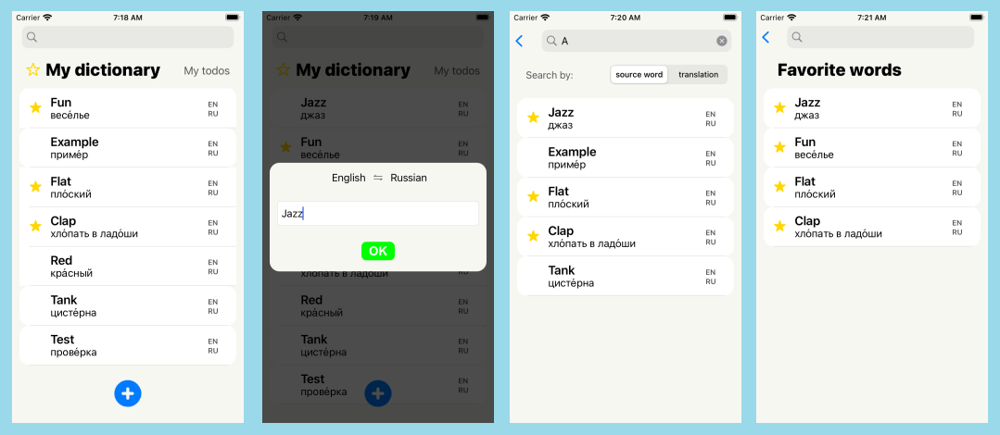
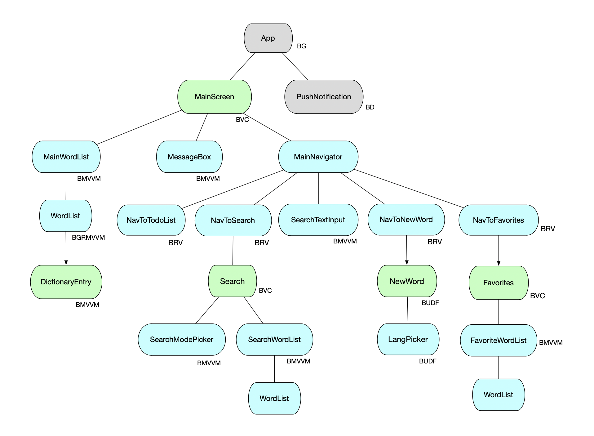

# Personal Dictionary (iOS App)

__App where a user creates a personal dictionary of foreign words.__

A user enters a word, the word is added to the personal dictionary. The app loads a translation for the word from an online translation API.

The user can see all words of the personal dictionary on the main screen of the app.

The app should be able to work with at least 3 languages and to change a direction of a translation.

The user can find a word in the dictionary by searching by a word or its translation.

The user can add a word to favorites. The app has a screen of favorite words. The user can remove a word from favorites.

A favorite word is marked with a star.

### The app stack.

UI: UIKit, code-based layout.

Architecture: MVVM, Clean Architecture.

The code should be covered by unit tests. You can use intergation, UI, snapshot testing.

Networking: `URLSession`.

Data storage: SQLite via Core Data.

---

## Notes on the solution.

To fetch translations from online API you have to get a key for [PONS Online Dictionary API](https://en.pons.com/p/online-dictionary/developers/api) and set it in a `ponsApiSecret` property of the app configuration object.

The app is implemented as a 'Super-app' where a user can work with _Personal Dictionary_ and _Todolist_. The code is modularized to 3 parts. The modules are Developments Pods of CocoaPods.

```
                  ------------
           ----->| CoreModule |<-
          |       ------------   |
          |                      |
 --------------------       ----------
| PersonalDictionary |---->| TodoList |
 --------------------       ----------

```

The Personal Dictionary has 4 screens:



* Main screen where a user can see all words of the dictionary.
* A screen where user can add a new word.
* The Search screen where a user can find words from the dictionary.
* A screen with a list of favorite words.

__The app architecture__. It can be represented as a tree of feature nodes:



Gray nodes represent viewless features, green is for a feature that implements a screen of the app, blue color is for a feature having a view that represents a part of a screen.

`B` - builder, `G` - graph, `R` - router, `V` - view, `VC` - ViewController, `MVVM` - UI pattern, `D` - domain.  

The code of the app screens are placed in the `UIFeature/FullScreen` folder of the `PersonalDictionary` module. 

`Builder` instantiates the app features.

`Repository` is local storage of the words of the personal dictionary. The implementation uses Core Data framework.

`TranslationService` fetches data from network API. The app addresses to PONS Online Dictionary API.

`CoreModule` - core types for the app.

The app is localized to 2 languages (_english_ and _russian_).

Dependency management: CocoaPods.

---

# General Guide to Architecture and App Feature Development.

Do not use global objects, variables and any implicit dependencies because their usage are bad practice.

An app is implemented as a __feature tree__. __Feature__ is an entity that represents product functionality or carries out the important role in the product.

A feature can use services or other types of dependencies. The distinction between them can be done voluntary.

## Builders

A feature is instantiated by a _builder_. In general, a builder looks like:

```swift
protocol FeatureBuilder {
    func build() -> FeatureGraph
}

final class FeatureBuilderImpl: FeatureBuilder {

    // feature dependencies

    init(/* external dependencies */) {
        // ...
    }

    func build() -> FeatureGraph {
        FeatureGraphImpl(/* feature dependencies */)
    }
}
```

A goal of a builder is to call a __feature graph__ intitializer with the required dependencies. Every feature has its own dependency scope. The feature gets external dependencies from the initialzer of its builder. Inner dependencies it defines inside of the scope of its own builder.

A builder of a feature is created by a builder of a parent feature.
Задача другой фичи - определить имплементацию билдера создаваемой фичи и, при необходимости, передать в него внешние зависимости. Какой-либо иной или особой логической связи между этими фичами не предполагается.

Для того, чтобы подключить фичу к какому-либо компоненту проекта, нужно передать билдер этой фичи в инициализатор данного компонента. 

## Граф фичи

Объяснение того, что такое граф фичи: https://www.youtube.com/watch?v=iN8BtJxRBWs

Если коротко, то граф - это DI-контейнер, который имеет output в виде функциональности, которую можно использовать в проекте.

## Взаимодействие фичей

Если фичи расположены по принципу child-parent, то можно сделать "родителя" делегатом "ребенка":

```swift
protocol FeatureListener: AnyObject {
    func onSomeDataChanged(_ data: SomeData)
}
```

Для "далеко расположенных" фичей обмен данными можно организовать следующим образом:

1) NotificationCenter, а лучше написать строго типизированные обертки вокруг него.

2) Rx Model Streams для записи и чтения (см. туториал к архитектуре RIBs).

3) Использовать Unidirectional Data Flow (ReSwift). Позволяет обойтись без делегатов, без Rx и без NotificationCenter.

