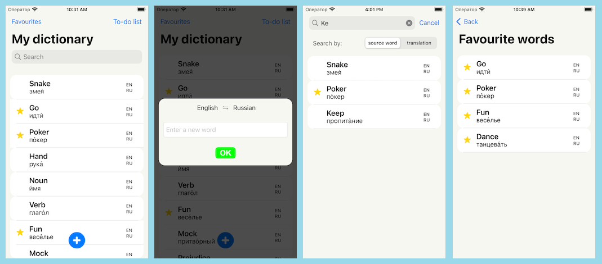

## Personal Dictionary – iOS app where a user keeps the personal dictionary of foreign words.

## Приложение, в котором пользователь может составить свой личный словарь незнакомых иностранных слов.

Пользователь вводит слово, слово добавляется в его персональный словарь и к слову подгружается перевод (напр., с API Яндекс Переводчика).

Пользователю выводятся все добавленные слова с переводами в виде списка.

Реализовать минимум 3 языка с возможностью менять направление перевода.

Пользователь может найти ранее добавленное слово в своем словаре используя функцию поиска по слову или по его переводу.

Добавление слов в Избранное. Это отдельный экран. Слова можно удалять из Избранного.

В общем списке избранные слова помечаются звездочкой.

Локальные пуш-уведомления с предложением добавить новое слово в личный словарь.

### Используемые технологии.

UI: UIKit, вёрстка из кода.

Архитектура: MVVM, Clean Architecture.

Асинхронная работа и устранение callback hell: `RxSwift`.

Способ работы с сетью: `URLSession`.

База данных: SQLite via Core Data.

Юнит-тесты.

---

## Замечания о решении.

Для корректной работы приложения следует получить ключ от PONS Online Dictionary API https://ru.pons.com/p/onlajn-slovar/developers/api и задать его в поле `ponsApiSecret` объекта `AppConfig` (см. код приложения).

API словаря может поддерживать не все направления перевода. Например, переводить с английского на русский или на итальянский, но не переводить с итальянского на русский.

# Общие сведения о решении

Приложение сделано в виде супераппа, в котором к функциональности _Личного словаря_ (`PersonalDictionary`) добавлена функциональность _Списка дел_ (`TodoList`). Код разложен по трём модулям. Модули реализованы в виде SPM packages.

```
                  ------------
           ----->| CoreModule |<-
          |       ------------   |
          |                      |
 --------------------       ----------
| PersonalDictionary |---> | TodoList |
 --------------------       ----------

```

В приложении PersonalDictionary реализованы 4 экрана:



* экран с главным списком слов
* экран добавления нового слова (чтобы добавить, надо нажать кнопку ОК)
* отдельный экран поиска по словам.
* экран со списком избранных слов.


__Общий вид архитектуры решения__. Оно имеет вид логического дерева фичей (feature tree):


Зеленый цвет - фичи, реализующие целый экран приложения, голубой - фичи, имеющие представление, которое по размерам меньше или равно экрану.

`B` - билдер, `G` - граф, `R` - роутер, `V` - view, `VC` - ViewController, `MVVM` - паттерн для UI, `D` - domain.  

Реализована слабая связанность экранов друг с другом. Код экранов расположен в папке `UIFeature/FullScreen` в соответствующих каждому экрану папках. За переходы между экранами отвечает `Router`, за инстанцирование фичей с их зависимостями отвечает `Builder`. 

Большое внимание уделено внедрению зависимостей, использованию протоколов и слабой связанности кода приложения.

Папка `Repository` - реализация локального хранения слов. За протоколом скрыта реализация на фреймворке Core Data.

Папка `TranslationService` - получение данных из внешнего сетевого API. Использован API онлайн-словаря PONS.

`CoreModule` - базовые типы и функциональность приложения.

Приложение локализовано на 2 языка (__английский__ и __русский__).

Для работы с модулями и их зависимостями использован SPM.

### Некоторые трудности при реализации проекта

Используемое API переводчика (по крайней мере, в бесплатной версии) имеет довольно сильные ограничения на частоту запросов, поэтому "живой" поиск слов и переводов не реализован.

API Яндекс Переводчика не использовалось в силу его платности.

---

# Общее руководство по архитектуре и реализации фичей Продукта

В коде не используются глобальные объекты, переменные и __любые__ неявные зависимости, поскольку их использование является плохой практикой.

Приложение реализуется как __дерево фичей__. __Фича__ - это сущность, представляющая продуктовую функциональность или выполняющая важную роль в продукте. В том, что считать фичей, а что считать __сервисом__ или функциональной __зависимостью__, лежащей в основе фичи, есть элемент субъективного выбора.

## Билдеры

Фича инстанцируется __билдером__. Билдер в общем случае имеет вид:

```swift
protocol FeatureBuilder {
    func build() -> FeatureGraph
}

final class FeatureBuilderImpl: FeatureBuilder {

    // feature dependencies

    init(/* external dependencies */) {
        // ...
    }

    func build() -> FeatureGraph {
        FeatureGraphImpl(/* feature dependencies */)
    }
}
```

Задача билдера - вызвать инициализатор __графа фичи__ с требуемыми зависимостями. Каждая фича имеет собственный scope зависимостей. Нужные внешние зависимости она получает через инициализатор билдера. Внутренние зависимости билдер определяет внутри себя.

Билдер фичи (за исключением root-фичи) создается билдером другой фичи. Задача другой фичи - определить имплементацию билдера создаваемой фичи и, при необходимости, передать в него внешние зависимости. Какой-либо иной или особой логической связи между этими фичами не предполагается.

Для того, чтобы подключить фичу к какому-либо компоненту проекта, нужно передать билдер этой фичи в инициализатор данного компонента. 

## Граф фичи

Объяснение того, что такое граф фичи: https://www.youtube.com/watch?v=iN8BtJxRBWs

Если коротко, то граф - это DI-контейнер, который имеет output в виде функциональности, которую можно использовать в проекте.

## Взаимодействие фичей

Если фичи расположены по принципу child-parent, то можно сделать "родителя" делегатом "ребенка":

```swift
protocol FeatureListener: AnyObject {
    func onSomeDataChanged(_ data: SomeData)
}
```

Для "далеко расположенных" фичей обмен данными можно организовать следующим образом:

1) NotificationCenter, а лучше написать строго типизированные обертки вокруг него.

2) Rx Model Streams для записи и чтения (см. туториал к архитектуре RIBs).

3) Использовать Unidirectional Data Flow. Позволяет обойтись без делегатов, без Rx и без NotificationCenter.

---

### Логирование

Что нужно логировать?

* Пользовательские действия (тапы, жесты, ввод текста и т.д.).
* Начало/успех/ошибки работы с асинхронной/синхронной IO/Network/Effect/API-операцией.
* Отправку/получение данных в/из stateful model stream.
* Модификации состояния модели данных в слое бизнес-логики (_state changes_).
* Показ/дисмисс экрана (_навигация_), инсталл/дисмисс фичи.

